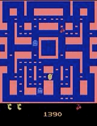

# AI-Gamer

This project was aimed at writing algorithms able to learn how to play various games (for example Atari).




[](https://www.youtube.com/watch?v=eeM2Rdbufco)
## Installing Atari package under Windows
The ```openai\atari-py``` package is not officially supported under Windows. However some slightly modified versions make it compatible. To install the correct version, first check that there is currently no versions installed with ```pip show atari-py```. If a version different than ```1.2.1``` is installed, do ```pip uninstall atari-py```. Then the right version can be installed with : 
```
pip install --no-index -f https://github.com/Kojoley/atari-py/releases atari_py
```

## How to use this repository?:
This repository contains both python files (```.py```) and python notebooks (```.ipynb```). Indeed some algorithms have been written on Google Colab and offer the most features, however, for convenience it is possible to run these codes on any interpreter with the python files.

The DQN algorithm for Atari is presented in a single version applied to the game Pong in order to show its versatility. It can be easily applied to other Atari games with some minor modifications (a few hyperparameters, and the delimitations of the cropped image in the ```wrappers.py``` file.
